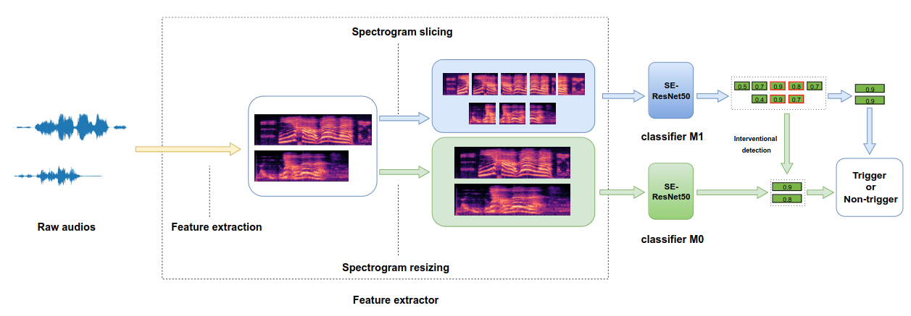
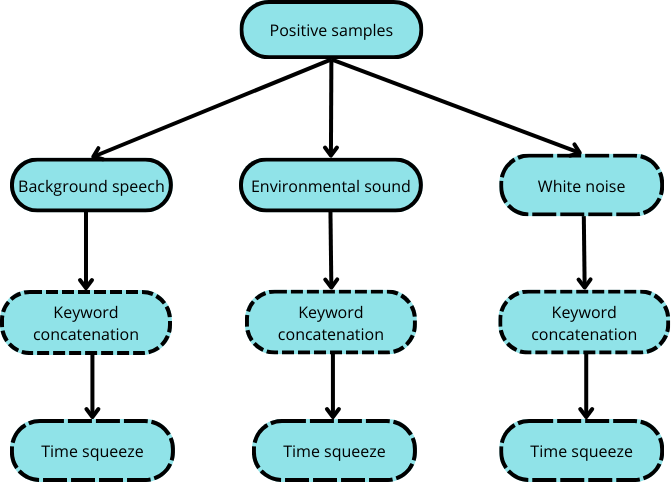

Following are the details on implementation of paper: https://arxiv.org/abs/2209.15296

In summary, system architecture is below. 


Work is entirely based on synthesized data. One can find scripts for synthesizing data in folder /data. For now, only TortoiseTTS and WaveGlow are used for synthetizing. In future work, I will add VITS and MARS. 

For capturing voice embeddings, I used the following datasets:
  - VoxCeleb Gender: https://dagshub.com/DagsHub/audio-datasets/src/main/voice_gender_detection (~7000 voices)
  - Speech accent archive: https://www.kaggle.com/datasets/rtatman/speech-accent-archive (~2300 voices)
  - People's Speech: https://mlcommons.org/datasets/peoples-speech/ (~15000 voices / randomly selected)


For training each model, I used roughly 3M audio files from People's speech dataset and chunk of CommonVoice dataset for the negative samples. This is approximately 5500h of speech. Production grade systems are trained on multiple times bigger datasets so I expect the achieved performance to be increased by further expanding the training set size. As for positive samples, I used following augmentation pipeline:  
<p align="center">

</p>


After the model is trained, we can convert it into onnx or tflite format suitable for edge device. Find .ipynb script for converting in /models folder.

### For benchmarking performance, I devised 2 testing sets:
  
  - test_clean -  1155 samples generated with high SNR(>10) using VCTK dataset voices. There are no real samples. This should be added in future.
  - test_other -  2126 noisier samples. I used background noise mixing methods.

### Complete list of used datasets:
  - Librispeech-test-clean(background speech augmentation)
  - DEMAND(background noise augmentation)
  - FSDNoisy(training set)
  - Mobvoi(testing set /chunk)
  - ESC-50(background noise augmentation)
  - Commonvoice(training set)
  - People's speech(training set)
  - VoxCeleb gender(training set)
  - Vocalsound(training set)
  - Speech accent(training set)

Proposed performance benchmark is DET curve. Find the implementation notebook in /inference folder.


### To initiate training of M0 model run following:
```
python train_M0.py \
  --train_csv_file /path/to/train.csv \
  --train_csv_file_stage2 /path/to/train_stage2.csv \
  --test_csv_file /path/to/test.csv \
  --ngpu 4 \
  --batch_size 256 \
  --num_stage_1_epochs 10 \
  --num_stage_2_epochs 5 \
  --pretrained_model_path /path/to/pretrained/model.pth \
  --clip_norm 1.0 \
  --lr 3e-4 \
  --save_path /path/to/save/checkpoints \
  --use_version_1 True
```
### To initiate training of M1 model run following:
```
python train_M1.py \
  --train_csv_file /path/to/train.csv \
  --train_csv_file_stage2 /path/to/train_stage2.csv \
  --test_csv_file /path/to/test.csv \
  --ngpu 4 \
  --batch_size 256 \
  --num_stage_1_epochs 10 \
  --num_stage_2_epochs 5 \
  --pretrained_model_path /path/to/pretrained/model.pth \
  --clip_norm 1.0 \
  --lr 3e-4 \
  --save_path /path/to/save/checkpoints \
  --use_version_1 True
```

Make sure you set master address and port correctly inside training script

